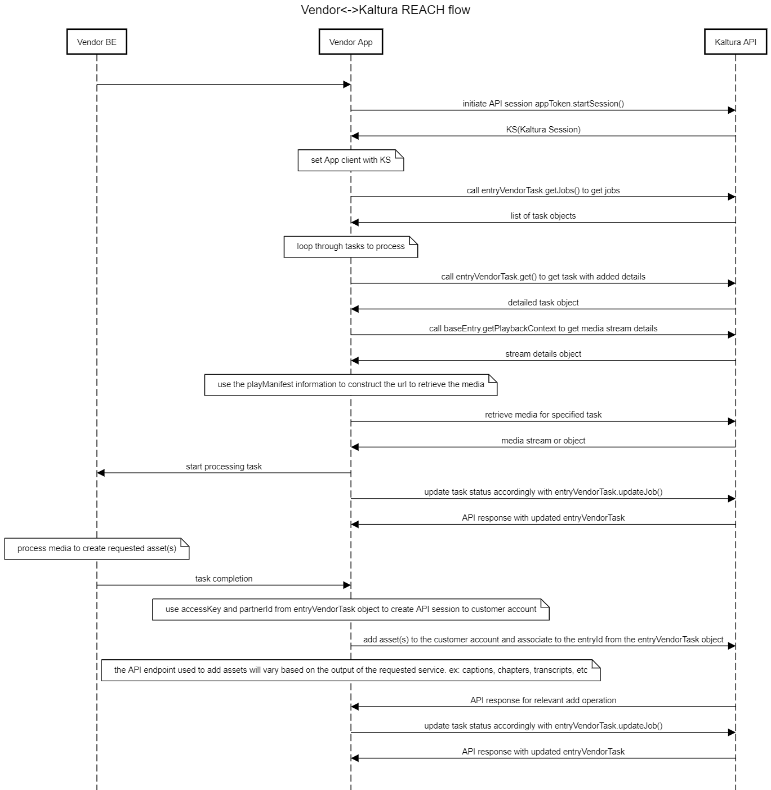

# REACH-Vendor-Integration
Guidance and examples on how REACH vendor partners can integrate with Kaltura.

# Audience
This guide is a reference for external Vendors who integrate with the Kaltura REACH framework.

# Summary
Kaltura REACH framework allows vendors to process Kaltura customer media and return enrichment assets, such as captions, transcripts, audio description, etc. Vendors get access to special APIs which allow them to periodically pull new REACH task requests (Each Task will contain metadata required for the vendor to process the request), process them, and update the customer's media with the resulting assets and/or metadata.

# Prerequisites
* A Vendor partner account.
  * This account must be configured by Kaltura.  Once configured, and the relevant REACH services are added to it, then you will be able to use the Kaltura API to retrieve tasks that have been submitted for the service(s) offered by you as a Vendor.
  * A list of supported service(s).  These are referred to as catalog items, and typically consist of 4 main parts (see https://developer.kaltura.com/api-docs/service/vendorCatalogItem for more details):
    * serviceFeature - ex: CAPTIONS
    * serviceType - ex: MACHINE
    * sourceLanguage - ex: EN
    * turnAroundTime - ex: THIRTY_MINUTES [1800]
  
* A Customer Persona partner account.
  * This is a standard Kaltura account, which will be enabled with your service(s).  You may use this account to simulate requests for your service(s).  Upon submission, those task service requests will be able to be retrieved and serviced by your Vendor partner account. 
  
# Getting started with the Kaltura API
see https://developer.kaltura.com/api-docs/VPaaS-API-Getting-Started/Getting-Started-VPaaS-API.html for guides and general reference on using the Kaltura API, including access to [Client Libraries in a number of languages](https://developer.kaltura.com/api-docs/Client_Libraries).

Kaltura strongly encourages the [use of appTokens for authenticating to the API.](https://developer.kaltura.com/api-docs/VPaaS-API-Getting-Started/application-tokens.html)

# Basic Workflow

# Workflow Description
The general flow implemented by a vendor would follow this outline:
1. Connect to Kaltura API and establish a valid session
2. Call [entryVendorTask.getJobs()](https://developer.kaltura.com/api-docs/service/entryVendorTask/action/getJobs) to get a list of jobs that have been submitted by any customer users for your services
3. Loop through the job objects in the response and get additional job details with [entryVendorTask.get()](https://developer.kaltura.com/api-docs/service/entryVendorTask/action/get)
4. Retrieve the asset related using details from [baseEntry.getPlaybackContext()](https://developer.kaltura.com/api-docs/service/baseEntry/action/getPlaybackContext) and the [playManifest API](https://developer.kaltura.com/api-docs/Deliver-and-Distribute-Media/playManifest-streaming-api.html)
5. Update the job status to PROCESSING using [entryVendorTask.updateJob()](https://developer.kaltura.com/api-docs/service/entryVendorTask/action/updateJob)
6. Process the requested job in the vendor backend/app.  Upon job completion on the vendor side, use the partnerId and accessKey (from the job request object) to add the generated assets (ex: captions, transcript, chapters, etc) to the requested media in the customer account
7. Update the job status to READY using [entryVendorTask.updateJob()](https://developer.kaltura.com/api-docs/service/entryVendorTask/action/updateJob)

## Workflow step details and notes
1. Connect to the Kaltura API using your Vendor account.  The Kaltura Partners team can provide you with this account and the relevant details.  We strongly suggest provisioning an appToken for this account and using that to spawn your API sessions. See [Getting started with application tokens](https://developer.kaltura.com/api-docs/VPaaS-API-Getting-Started/application-tokens.html) for more information on appToken sessions.  Also, you can find [pre-compiled Kaltura API client libraries in a number of languages](https://developer.kaltura.com/api-docs/Client_Libraries) to help you get started.
   - The client lib exposes the ability to define a Client Tag for each API request. This property is used later by Kaltura to track which application issued which call. With REACH we make another use of this field. To ensure Kaltura has a way to determine the Task processing E2E, the vendor should follow the following standards:
     - For non task-specific API calls, the client tag should be set to be '<default clientTag>_vendorName-vendorPartnerId'. (default clientTag consists of the client library programming language and the library build date) . Example: 'php5:18-11-11_vendorName_12345'
     - For task-specific API calls, the Task ID should also be added to the clientTag: Example, for PHP5 client library, Task ID (9292) and vendor account id (12345), the resulting client tag should be "php5:18-11-11_vendorName-12345-9292"
   - The appToken should be set with 'disableentitlement' privilege.  The default expiry is 24 hours, but can be set as desired.
2. Once you have a valid client session established, make a call to [entryVendorTask.getJobs()](https://developer.kaltura.com/api-docs/service/entryVendorTask/action/getJobs).  This will return a list of requested jobs for your Vendor account.  Make sure to use the following parameters in your request:
   - entryVendorTaskFilter->vendorPartnerIdEqual - set this parameter to be the vendor partner ID (should be the same value for all tasks)
   - entryVendorTaskFilter->statusEqual = PENDING - this will only return a list of tasks that are PENDING processing by the vendor.
   - depending on the number of tasks, you may need to use the pager object to paginate results
3. Once you have the full list of tasks, then you'll need to connect to each customer account to retrieve additional details about the request (custom dictionaries, whether or not to set the captions to auto-display, etc).  To do so, you'll loop through the list of tasks and make a call to [entryVendorTask.get()](https://developer.kaltura.com/api-docs/service/entryVendorTask/action/get).  When making this call, you'll need to supply the following parameters:
   - id - this is the task id and will have been included in the task object from the entryVendorTask.getJobs() call.
   - ks - this is a global parameter in the API client.  For this call, you'll need to change your client KS (Kaltura Session) to match the accessKey returned in the task object.  This KS is associated to the specific customer account and media related to the originating task request.  This value will change with each task you are looping through, so be sure to set it accordingly for each task.
   - responseProfile - this is also a global parameter in the API client.  The object type should be ResponseProfileHolder, and you should set the systemName attribute value to 'reach_vendor'.  This tells the API to return additional information related to the Customer's REACH profile such as dictionaries, processing region, caption display settings, and other pertinent details.  This will UNSET after each API call, so it will need to be reset for each subsequent call, much like the KS.
4. Once you have the task details, you'll need to get the media for the specified request.  You'll have the option to download the needed flavor (transcoded rendition), or obtain an HLS manifest to allow you to stream the file (audio, video, or both) and concatenate the segments on your end to rebuild them into a file.  To do so, maintain the specific KS for the task, and make a call to [baseEntry.getPlaybackContext()](https://developer.kaltura.com/api-docs/service/baseEntry/action/getPlaybackContext). 
   - Supply the following parameters:
     - ks - ensure that the KS matches the accessKey from the original task request.
     - entryId - this id will have been supplied in the original task request.
     - contextDataParams->objectType = KalturaPlaybackContextOptions
     - contextDataParams->streamerType = "http" if you want the downloadable file, or "applehttp" if you want HLS manifest(s).
     - contextDataParams->ks = the ks, or accessKey, from the original task object
   - Based on the response from the above call, you should have the needed information to get the needed media.  See [information on the playManifest API](https://developer.kaltura.com/api-docs/Deliver-and-Distribute-Media/playManifest-streaming-api.html) for details on constructing stream or download urls for the media. Be sure to include the customer partnerId and ks (accessKey) that were provided in the original request task object.
     - if you wish to ultilize HLS and only retrieve the audio track, or just the video track, see [url path parameters](https://github.com/kaltura/nginx-vod-module#url-path-parameters) for details.
5. Once you have the media and begin to process the task, you'll need to update the task status.  To do so, call the [entryVendorTask.updateJob()](https://developer.kaltura.com/api-docs/service/entryVendorTask/action/updateJob) endpoint.  For normal scenarios, you'll update the job with the following:
   - status = PROCESSING
   - ks - make sure the set your KS back to your vendor KS that was generated with your vendor appToken when your polling process began.
6. Upon completion of processing the request on the vendor side, you'll need to update the entry in Kaltura with the relevant generated assets (caption, transcript, chapters, audio description track, etc).  Depending on the service requested and the generated output, you may need to use any of the following:
   - [attachmentAsset.add()](https://developer.kaltura.com/api-docs/service/attachmentAsset/action/add) - for adding transcripts, or other attachments
   - [captionAsset.add()](https://developer.kaltura.com/api-docs/service/captionAsset/action/add) - for adding caption files
   - [cuePoint.add()](https://developer.kaltura.com/api-docs/service/cuePoint/action/add) - for adding cue points, like chapters
   - [flavorAsset.add()](https://developer.kaltura.com/api-docs/service/flavorAsset/action/add) - for adding additional flavors, like an audio description track
   - [baseEntry.update()](https://developer.kaltura.com/api-docs/service/baseEntry/action/update) - for updating basic metadata, like tags, titles, descriptions, etc.  When using baseEntry.update(), you'd first need to call [baseEntry.get()](https://developer.kaltura.com/api-docs/service/baseEntry/action/get) to return any existing metadata before merging/amending with any additional data.
   - For all calls, be sure to use the accessKey (ks), partnerId, and entryId that were specified in the original task object.  In addition, some object types may need reference to other objects (like captionAsset has a parameter for reference to the transcript (attachmentAsset), so be sure to supply those where needed.  If you have additional questions, feel free to ask the Kaltura Partners team for added guidance.
7. After adding the requested assets to the entry, update the job status again using [entryVendorTask.updateJob()](https://developer.kaltura.com/api-docs/service/entryVendorTask/action/updateJob).
   - be sure to reset the ks back to your vendor ks.
   - on success, set the 'status' to 'READY', and the outputObjectId to the id  returned for the asset you created (if multiple, just use the first or most prominent)
   - for any kind of error encountered, set the 'status' to 'ERROR', and use the 'errDescription' field to provide more details on the error.
   - use the 'externalTaskId' parameter to store any relevant task processing identifiers in your system.  This will help if we ever need to track a task back to you to troubleshoot or provide additional information.
 
# Additional Information
   - Kaltura operates a global SaaS, regional cloud, and on-prem instances.  You will need a service/process to run against each of these environments you wish to support.  For more information, see [API Endpoints](resources/API_Endpoints.md)
   - If the accessKey provided in the original task object expires, you may utilize [entryVendorTask.extendAccessKey()](https://developer.kaltura.com/api-docs/service/entryVendorTask/action/extendAccessKey) to generate a new accessKey (ks) for the task.
   - Tasks will include a deletion policy specifying how long a vendor should be allowed to maintain a copy of the media asset after processing before purging the asset.
   - Tasks will also include a specified processing region, in the event the vendor supports processing content in multiple regions (ex: to support GDPR, etc).
   - Job prioritization - the vendor should have a queueing mechanism that gives equal priority to all jobs, regardless of the customer that initiated the request.
   - Kaltura and the Partner/Vendor will both perform joint QA on any REACH integration before it moves to Production.
   - See [resources](resources) for more help. 
   
   

